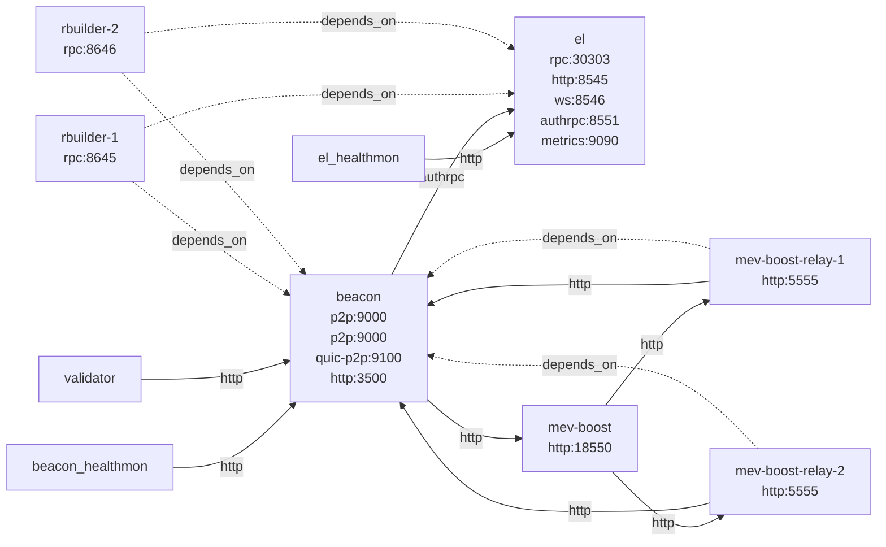

# l1-multi-builder Recipe

Deploy a full L1 stack with multiple builders and relays.

## Flags

- `block-time` (duration): Block time to use for the L1. Default to '12s'.
- `builders` (int): number of rbuilder instances to run. Default to '2'.
- `latest-fork` (bool): use the latest fork. Default to 'false'.
- `relays` (int): number of mev-boost-relay instances to run. Default to '2'.
- `use-reth-for-validation` (bool): use reth for validation. Default to 'false'.

## Architecture Diagram

