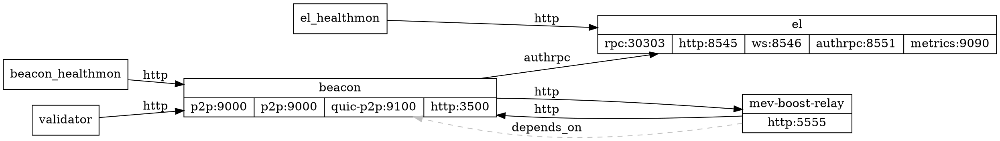

# l1 Recipe

Deploy a full L1 stack with mev-boost.

## Flags

- `block-time` (duration): Block time to use for the L1. Default to '12s'.
- `latest-fork` (bool): use the latest fork. Default to 'false'.
- `secondary-el` (string): Address or port to use for the secondary EL (execution layer); Can be a port number (e.g., '8551') in which case the full URL is derived as `http://localhost:<port>` or a complete URL (e.g., `http://docker-container-name:8551`), use `http://host.docker.internal:<port>` to reach a secondary execution client that runs on your host and not within Docker.. Default to ''.
- `use-native-reth` (bool): use the native reth binary. Default to 'false'.
- `use-reth-for-validation` (bool): use reth for validation. Default to 'false'.
- `use-separate-mev-boost` (bool): use separate mev-boost and mev-boost-relay services. Default to 'false'.

## Architecture Diagram

