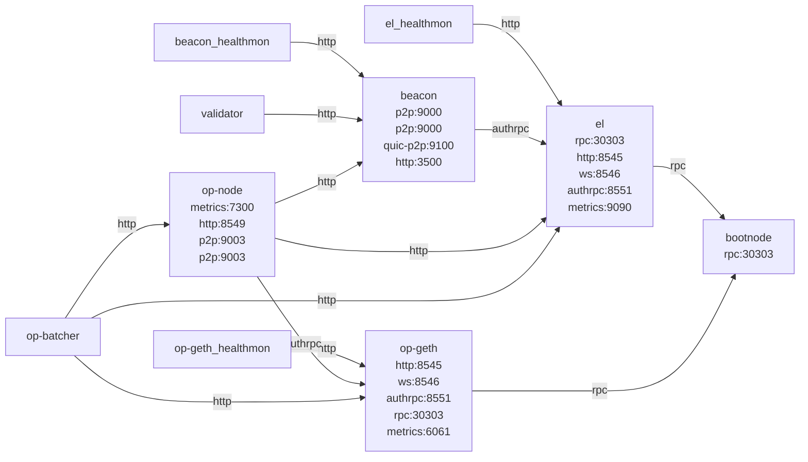

# opstack Recipe

Deploy an OP stack.

## Flags

- `base-overlay` (bool): Whether to use base implementation for flashblocks-rpc. Default to 'false'.
- `batcher-max-channel-duration` (uint64): Maximum channel duration to use for the batcher. Default to '2'.
- `block-time` (uint64): Block time to use for the rollup. Default to '2'.
- `chain-monitor` (bool): Whether to enable chain-monitor. Default to 'false'.
- `enable-latest-fork` (uint64): Enable Jovian fork: 0 = at genesis, N > 0 = at block N (default: Isthmus only). Default to 'nil'.
- `enable-websocket-proxy` (bool): Whether to enable websocket proxy. Default to 'false'.
- `external-builder` (string): External builder URL. Default to ''.
- `flashblocks` (bool): Whether to enable flashblocks. Default to 'false'.
- `flashblocks-builder` (string): External URL of builder flashblocks stream. Default to ''.

## Architecture Diagram

